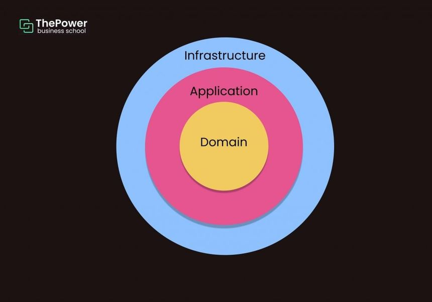

Hexagonal Arhictecture

- user>core
  here we have the domain layer where i defined User entity and User Repository (where i specify the methods as interface), this repository is ABSTRACT so i can use for the usecases in application layer for Depency Inversion (High level modules musn't depend on Low Level modules, both must depend on ABSTRACTIONS)
- user>application
  Here we have the use-cases where i declare the repository variable as type of userRepository which is a dependency that is going to be injected.

```ts
export class UserCreator {
  private readonly userRepository: IUserRepository; // Dependency Inversion
  // IUserRepository is a type so it is an abstraction of how the repository should be
  constructor(userRepository: IUserRepository) {
    // Dependency Injection >> we are creating this dependency outside and injecting it to this class instead of creating it in here.
    this.userRepository = userRepository;
  }

  public async run(email: string, password: string): Promise<User> {
    const user = new User(email, password);
    return await this.userRepository.save(user);
  }
}
```

- user > infra
  here we have the entries and outputs of the application, like the controllers or DB connections/repositories


